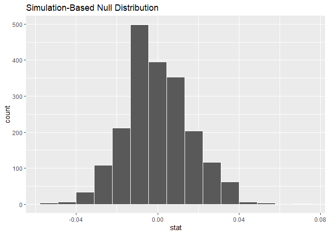
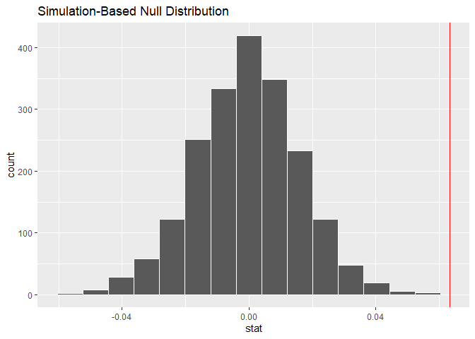

Time to Define the Relationship
================
Mohamad Osman
2022-08-10

# **`Section 04: Time to Define the Relationship`**

### 

**`01-Common assumptions of hypothesis tests`**

Hypothesis tests make assumptions about the dataset that they are
testing, and the conclusions you draw from the test results are only
valid if those assumptions hold. While some assumptions differ between
types of test, others are common to all hypothesis tests.

Which of the following statements is a common assumption of hypothesis
tests?

-   Sample observations are collected deterministically from the
    population.

-   Sample observations are correlated with each other.

-   Sample observations have no direct relationship with each other.
    **✔️**

-   Sample sizes are greater than thirty observations.

Ace assumption! All hypothesis tests assume that the data are collected
at random from the population, that each row is independent of the
others, and that the sample size is big enough.

### **`02-Testing sample size`**

In order to conduct a hypothesis test, and be sure that the result is
fair, a sample must meet three requirements: it is a random sample of
the population; the observations are independent; and there are enough
observations. Of these, only the last condition is easily testable with
code.

The minimum sample size depends on the type of hypothesis tests you want
to perform. Let’s test some scenarios on the `late_shipments` dataset.

`late_shipments` is available; `dplyr` is loaded.

-   Using the `late_shipments` dataset, get counts by the
    `freight_cost_group` columns.

-   Insert a suitable number to inspect whether the counts are “big
    enough” for a two sample t-test.

``` r
library(dplyr)
```

    ## 
    ## Attaching package: 'dplyr'

    ## The following objects are masked from 'package:stats':
    ## 
    ##     filter, lag

    ## The following objects are masked from 'package:base':
    ## 
    ##     intersect, setdiff, setequal, union

``` r
library(ggplot2)
library(fst)

file_path <- file.path("..", "00_Datasets", "late_shipments.fst")
late_shipments <- read_fst(file_path)
file_path_2 <- file.path("..", "00_Datasets", "late_shipments_add_cols.txt")
add_cols_late_shipments <- read.delim(file_path_2)[1]
late_shipments <-cbind(late_shipments, add_cols_late_shipments)
```

``` r
# Get counts by freight_cost_group
counts <- late_shipments %>%
           count(freight_cost_group) 


# See the result
counts
```

    ##   freight_cost_group   n
    ## 1          expensive 541
    ## 2         reasonable 459

``` r
# Inspect whether the counts are big enough
all(counts$n >= 30)
```

    ## [1] TRUE

-   Using the `late_shipments` dataset, get counts by the `late` column.

-   Insert a suitable number to inspect whether the counts are “big
    enough” for a one sample proportion test.

``` r
# Get counts by late
counts <- late_shipments %>%
          count(late)


# See the result
counts
```

    ##   late   n
    ## 1   No 933
    ## 2  Yes  67

``` r
# Inspect whether the counts are big enough
all(counts$n >= 10)
```

    ## [1] TRUE

-   Using the `late_shipments` dataset, get counts by the
    `vendor_inco_term` and `freight_cost_group` columns.

-   Insert a suitable number to inspect whether the counts are “big
    enough” for a chi-square independence test.

``` r
# Count the values of vendor_inco_term and freight_cost_group
counts <- late_shipments %>%
          count(vendor_inco_term, freight_cost_group)


# See the result
counts
```

    ##    vendor_inco_term freight_cost_group   n
    ## 1               CIF         reasonable   1
    ## 2               CIP          expensive  14
    ## 3               CIP         reasonable  40
    ## 4               DAP         reasonable   1
    ## 5               DDP          expensive  59
    ## 6               DDP         reasonable  27
    ## 7               DDU         reasonable   1
    ## 8               EXW          expensive 429
    ## 9               EXW         reasonable 317
    ## 10              FCA          expensive  39
    ## 11              FCA         reasonable  72

``` r
# Inspect whether the counts are big enough
all(counts$n >= 5)
```

    ## [1] FALSE

-   Using the `late_shipments` dataset, get counts by the
    `shipment_mode` column.

-   Insert a suitable number to inspect whether the counts are “big
    enough” for an ANOVA test.

``` r
# Count the values of shipment_mode
counts <- late_shipments %>%
            count(shipment_mode)


# See the result
counts
```

    ##   shipment_mode   n
    ## 1           Air 909
    ## 2   Air Charter   6
    ## 3           N/A   1
    ## 4         Ocean  84

``` r
# Inspect whether the counts are big enough
all(counts$n >= 30)
```

    ## [1] FALSE

Setting a great example for an ample sample! While randomness and
independence of observations can’t easily be tested programmatically,
you can test that your sample sizes are big enough to make a hypothesis
test appropriate.

### 

**`03-There is only one test`**

You’ve encountered several types of traditional hypothesis test:
t-tests, ANOVA tests, proportion tests, and chi-square tests. You may
have noticed that there were similarities in the workflow for performing
each test.

Allen Downey proposed that all traditional hypothesis tests were special
cases of a generic hypothesis test. He called this the “There is Only
One Test” framework, and it forms a “grammar of hypothesis tests”,
analogous to the “grammar of graphics” implemented by `ggplot2`.

In which situations will the “There is Only One Test” framework provide
p-value and decision rule results that are different than a traditional
method like `prop_test()`?

-   The results should always be similar.

-   When the assumptions for the traditional method are not met. **✔️**

-   When the sample size is large enough that the Central Limit Theorem
    applies.

-   When groups in the dataset are perfectly balanced.

One test to rule them all, one test to find them… Simulation-based
hypothesis tests allow more flexibility, and are not bound by the
assumptions of traditional hypothesis tests.

### **`04-Specifying & hypothesizing`**

In Chapter 3, you ran a two sample proportion test on the proportion of
late shipments across freight cost groups. Recall the hypotheses.

H0: lateexpensive−latereasonable=0

HA: lateexpensive−latereasonable\>0

Let’s compare that traditional approach using `prop_test()` with a
simulation-based infer pipeline.

`late_shipments` is available; `dplyr` and `infer` are loaded.

Run the proportion test code (previously seen in Chapter 3). Assuming a
significance level of `alpha = 0.05`, what does the evidence suggest?

``` r
library(infer)

# Perform a proportion test appropriate to the hypotheses 
test_results <- late_shipments %>% 
  prop_test(
    late ~ freight_cost_group,
    order = c("expensive", "reasonable"),
    success = "Yes",
    alternative = "greater",
    correct = FALSE
  )

# See the results
test_results
```

    ## # A tibble: 1 × 6
    ##   statistic chisq_df   p_value alternative lower_ci upper_ci
    ##       <dbl>    <dbl>     <dbl> <chr>          <dbl>    <dbl>
    ## 1      16.0        1 0.0000319 greater        0.164        1

-   The p-value is less than or equal to the significance level, so you
    should reject the null hypothesis that the proportion of late
    shipments is the same for each freight cost group. **✔️**

-   The p-value is less than or equal to the significance level, so you
    should fail to reject the null hypothesis that the proportion of
    late shipments is the same for each freight cost group.

-   The p-value is greater than the significance level, so you should
    reject the null hypothesis that the proportion of late shipments is
    the same for each freight cost group.

-   The p-value is greater than the significance level, so you should
    fail to reject the null hypothesis that the proportion of late
    shipments is the same for each freight cost group.

Q:

-   Using the `late_shipments` dataset, specify that we are interested
    in `late` proportions across `freight_cost_group`, where `"Yes"`
    denotes success.

``` r
# Specify that we are interested in late proportions across freight_cost_groups, where "Yes" denotes success
specified <- late_shipments %>%
        specify(
            late ~ freight_cost_group, 
            success = "Yes"
        )

# See the result
specified
```

    ## Response: late (factor)
    ## Explanatory: freight_cost_group (factor)
    ## # A tibble: 1,000 × 2
    ##    late  freight_cost_group
    ##    <fct> <fct>             
    ##  1 No    reasonable        
    ##  2 No    expensive         
    ##  3 No    expensive         
    ##  4 Yes   expensive         
    ##  5 No    reasonable        
    ##  6 No    reasonable        
    ##  7 No    expensive         
    ##  8 No    expensive         
    ##  9 No    expensive         
    ## 10 No    reasonable        
    ## # … with 990 more rows
    ## # ℹ Use `print(n = ...)` to see more rows

-   Extend the pipeline to declare a null hypothesis that the variables
    are independent.

``` r
# Extend the pipeline to declare a null hypothesis that the variables are independent
hypothesized <- late_shipments %>% 
  specify(
    late ~ freight_cost_group, 
    success = "Yes"
  ) %>% 
  hypothesize(null ="independence")

# See the result
hypothesized
```

    ## Response: late (factor)
    ## Explanatory: freight_cost_group (factor)
    ## Null Hypothesis: independence
    ## # A tibble: 1,000 × 2
    ##    late  freight_cost_group
    ##    <fct> <fct>             
    ##  1 No    reasonable        
    ##  2 No    expensive         
    ##  3 No    expensive         
    ##  4 Yes   expensive         
    ##  5 No    reasonable        
    ##  6 No    reasonable        
    ##  7 No    expensive         
    ##  8 No    expensive         
    ##  9 No    expensive         
    ## 10 No    reasonable        
    ## # … with 990 more rows
    ## # ℹ Use `print(n = ...)` to see more rows

Super specifying and hyper hypothesizing! The first two steps in the
infer pipeline add attributes to the dataset in order to set up the
simulation.

### **`05-Generating & calculating`**

The infer pipeline for hypothesis testing requires four steps to
calculate the null distribution: specify, hypothesize, generate, and
calculate.

Let’s continue the pipeline you began in the previous coding exercise.
We’ll get a set of differences in proportions that are distributed as
though the null hypothesis, that the proportion of late shipments is the
same across freight cost groups, is true.

`late_shipments` is available; `dplyr`, `infer`, and `ggplot2` are
loaded.

-   Extend the infer pipeline to generate two thousand permutation
    replicates. (Note this will take a few seconds to complete.)

``` r
# Extend the pipeline to generate 2000 permutations
generated <- late_shipments %>% 
  specify(
    late ~ freight_cost_group, 
    success = "Yes"
  ) %>% 
  hypothesize(null = "independence") %>% 
  generate(reps = 2000, type = "permute")

# See the result
head(generated)
```

    ## # A tibble: 6 × 3
    ## # Groups:   replicate [1]
    ##   late  freight_cost_group replicate
    ##   <fct> <fct>                  <int>
    ## 1 No    reasonable                 1
    ## 2 No    expensive                  1
    ## 3 No    expensive                  1
    ## 4 No    expensive                  1
    ## 5 No    reasonable                 1
    ## 6 No    reasonable                 1

``` r
nrow(generated)
```

    ## [1] 2000000

-   Complete the infer pipeline for the null distribution by calculating
    the difference in proportions, setting the order to expensive
    proportion minus reasonable proportion.

``` r
# Extend the pipeline to calculate the difference in proportions (expensive minus reasonable)
null_distn <- late_shipments %>% 
  specify(
    late ~ freight_cost_group, 
    success = "Yes"
  ) %>% 
  hypothesize(null = "independence") %>% 
  generate(reps = 2000, type = "permute") %>% 
  calculate(stat = "diff in props", 
            order = c("expensive", "reasonable"))


# See the result
head(null_distn)
```

    ## Response: late (factor)
    ## Explanatory: freight_cost_group (factor)
    ## Null Hypothesis: independence
    ## # A tibble: 6 × 2
    ##   replicate     stat
    ##       <int>    <dbl>
    ## 1         1 -0.0252 
    ## 2         2  0.0312 
    ## 3         3  0.00706
    ## 4         4 -0.00502
    ## 5         5 -0.0332 
    ## 6         6  0.0191

-   Visualize the null distribution.

``` r
# From previous steps
null_distn <- late_shipments %>% 
  specify(
    late ~ freight_cost_group, 
    success = "Yes"
  ) %>% 
  hypothesize(null = "independence") %>% 
  generate(reps = 2000, type = "permute") %>% 
  calculate(
    stat = "diff in props", 
    order = c("expensive", "reasonable")
  )

# Visualize the null distribution
visualize(null_distn) 
```

<!-- -->

Easy as 1, 2, 3, 4! Calling those four functions in order will generate
a null distribution. To determine a result from the test, we need to
compare this null distribution to the observed statistic.

### 

**`06-Observed statistic and p-value`**

You now have a null distribution. In order to get a p-value and weigh up
the evidence against the null hypothesis, you need to calculate the
difference in proportions that is observed in the `late_shipments`
sample.

`late_shipments` is available; `dplyr`, `infer`, and `ggplot2` are
loaded.

-   Copy, paste, and modify the null distribution pipeline to get the
    observed statistic.

``` r
null_distn <- late_shipments %>% 
  specify(
    late ~ freight_cost_group, 
    success = "Yes"
  ) %>% 
  hypothesize(null = "independence") %>% 
  generate(reps = 2000, type = "permute") %>% 
  calculate(
    stat = "diff in props", 
    order = c("expensive", "reasonable")
  )

# Copy, paste, and modify the pipeline to get the observed statistic
obs_stat <- late_shipments %>% 
  specify(
    late ~ freight_cost_group, 
    success = "Yes"
  ) %>% 
  #hypothesize(null = "independence") %>% 
  #generate(reps = 2000, type = "permute") %>% 
  calculate(
    stat = "diff in props", 
    order = c("expensive", "reasonable")
  )

# See the result
obs_stat
```

    ## Response: late (factor)
    ## Explanatory: freight_cost_group (factor)
    ## # A tibble: 1 × 1
    ##     stat
    ##    <dbl>
    ## 1 0.0634

-   Visualize the null distribution, adding a vertical line at the
    observed statistic.

``` r
# Visualize the null dist'n, adding a vertical line at the observed statistic
visualize(null_distn) + 
   geom_vline(aes(xintercept = stat),    
              data = obs_stat,    
              color ="red")
```

<!-- -->

Get the p-value from the null distribution and observed statistic,
assuming an appropriate direction for the alternative hypothesis.

``` r
# Get the p-value
p_value <- get_p_value(null_distn, obs_stat,  direction ="two sided")# Not alternative = "two.sided"
```

    ## Warning: Please be cautious in reporting a p-value of 0. This result is an
    ## approximation based on the number of `reps` chosen in the `generate()` step. See
    ## `?get_p_value()` for more information.

``` r
# See the result
p_value
```

    ## # A tibble: 1 × 1
    ##   p_value
    ##     <dbl>
    ## 1       0

Proportion test simulation success! The p-value is calculated from the
null distribution and the observed statistic. Here, the observed
difference in proportions appears way outside of the null distribution
histogram, which resulted in a p-value of zero. This can be interpreted
as “p is very small”, rather than actually zero.

### 

**`07-Simulation-based t-test`**

In Chapter 2 you manually performed the steps for a t-test to explore
these hypotheses.

H0: The mean weight of shipments that weren’t late is the same as the
mean weight of shipments that were late.

HA: The mean weight of shipments that weren’t late is less than the mean
weight of shipments that were late.

You can run the test more concisely using infer’s `t_test()`.

    late_shipments %>% 
      t_test(
        weight_kilograms ~ late,
        order = c("No", "Yes"),
        alternative = "less"
      )

`t_test()` assumes that the null distribution is normal. We can avoid
assumptions by using a simulation-based non-parametric equivalent.

`late_shipments` is available; `dplyr` and `infer` are loaded.

-   Specify weight in kilograms versus whether or not the shipment was
    late.

-   Declare a null hypothesis of independence.

-   Generate 1000 permutation replicates.

-   Calculate the difference in means, setting the order as `"No"` minus
    `"Yes"`.

``` r
# Fill out the null distribution pipeline
null_distn <- late_shipments %>% 
  # Specify weight_kilograms vs. late
  specify(weight_kilograms ~ late) %>% 
  # Declare a null hypothesis of independence
  hypothesize(null ="independence") %>% 
  # Generate 1000 permutation replicates
  generate(reps = 1000) %>% 
  # Calculate the difference in means ("No" minus "Yes")
  calculate(stat ="diff in means", 
            order = c("No", "Yes"))
```

    ## Setting `type = "permute"` in `generate()`.

``` r
# See the results
null_distn
```

    ## Response: weight_kilograms (numeric)
    ## Explanatory: late (factor)
    ## Null Hypothesis: independence
    ## # A tibble: 1,000 × 2
    ##    replicate    stat
    ##        <int>   <dbl>
    ##  1         1   389. 
    ##  2         2    84.3
    ##  3         3  -211. 
    ##  4         4   178. 
    ##  5         5   216. 
    ##  6         6   144. 
    ##  7         7   534. 
    ##  8         8    51.6
    ##  9         9  -431. 
    ## 10        10 -2172. 
    ## # … with 990 more rows
    ## # ℹ Use `print(n = ...)` to see more rows

-   Calculate the difference in means observed in the `late_shipments`
    dataset.

``` r
# Calculate the observed difference in means
obs_stat <- obs_stat <- late_shipments %>% 
  specify(weight_kilograms ~ late) %>% 
  calculate(
    stat = "diff in means", 
    order = c("No", "Yes")
  )
# See the result
obs_stat
```

    ## Response: weight_kilograms (numeric)
    ## Explanatory: late (factor)
    ## # A tibble: 1 × 1
    ##    stat
    ##   <dbl>
    ## 1 -296.

-   Get the p-value from the null distribution and the observed
    difference in means, setting an appropriate direction.

``` r
# Get the p-value
p_value <- get_p_value(
  null_distn, obs_stat, 
  direction = "less"
)
# See the result
p_value
```

    ## # A tibble: 1 × 1
    ##   p_value
    ##     <dbl>
    ## 1   0.213

Nice non-parametric testing! The p-value with the traditional t-test was
0.04, and the p-value from the simulation was close to 0.1. Depending
upon the significance level you chose for the tests, this difference in
p-values could have important consequences for whether or not to reject
the null hypothesis.

### **`08-Rank sum tests`**

Another class of non-parametric hypothesis tests are called *rank sum
tests*. Ranks are the positions of numeric values from smallest to
largest. Think of them as positions in running events: whoever has the
fastest (smallest) time is rank 1, second fastest is rank 2, and so on.

By calculating on the ranks of data instead of the actual values, you
can avoid making assumptions about the distribution of the test
statistic. It’s most robust in the same way that a median is more robust
than a mean.

Two commonly used rank-based tests are the Wilcoxon-Mann-Whitney test,
which is like a non-parametric t-test, and the Kruskal-Wallis test,
which is like a non-parametric ANOVA.

`late_shipments` is available.

-   Using the `late_shipments` dataset, run a Wilcoxon-Mann-Whitney test
    on the weight in kilograms versus whether or not the shipment was
    late.

``` r
# Run a Wilcoxon-Mann-Whitney test on weight_kilograms vs. late
test_results <- wilcox.test(weight_kilograms ~ late, data = late_shipments)


# See the result
test_results
```

    ## 
    ##  Wilcoxon rank sum test with continuity correction
    ## 
    ## data:  weight_kilograms by late
    ## W = 21480, p-value = 1.861e-05
    ## alternative hypothesis: true location shift is not equal to 0

-   Using the `late_shipments` dataset, run a Kruskal-Wallace test on
    the weight in kilograms versus the shipment mode.

``` r
# Run a Kruskal-Wallace test on weight_kilograms vs. shipment_mode
test_results <- kruskal.test(weight_kilograms ~ shipment_mode, data = late_shipments)
# See the result
test_results
```

    ## 
    ##  Kruskal-Wallis rank sum test
    ## 
    ## data:  weight_kilograms by shipment_mode
    ## Kruskal-Wallis chi-squared = 159.7, df = 3, p-value < 2.2e-16

They tried to make me use parameters, but I said “No, no, no”. The
Wilcoxon-Mann-Whitney and Kruskal-Wallace tests are useful when you
cannot satisfy the assumptions for parametric tests, and don’t want the
computational expense of simulation-based tests.

### **`The End`**
